# Engine

**An AI-visibility platform that fixes what it finds.**

Search is splitting in two. For twenty years being found meant ranking — ten blue
links, a click, your site. Increasingly people ask instead of search, and the
answer arrives already written, assembled from a handful of sources the user
never visits. Engine measures how visible a business is across *both* worlds —
organic search and AI answers — and then deploys the changes that move it.

The measurement half is table stakes; several products do it. The half that is
hard, and the half this project is actually about, is **execution**: taking a
finding, turning it into a concrete diff, deploying that diff into the customer's
own site, CMS or Business Profile, verifying it took effect, and rolling it back
when it didn't.

> **This is a portfolio repository.** It documents a working private codebase —
> the screenshots below are the real product running, not mockups. Source code,
> product specs, and infrastructure configuration are not published here.

---

## Contents

- [The product](#the-product)
- [Screenshots](#screenshots)
- [How it is built](#how-it-is-built)
- [Engineering decisions](#engineering-decisions)
- [By the numbers](#by-the-numbers)

---

## The product

Engine is a monorepo containing a marketing site, a public documentation site, a
REST API on Cloudflare Workers, an edge worker for deploying and rolling back
fixes, a distributed crawler, CMS plugins for WordPress and Shopify, and a
single-page dashboard that ties it together.

The dashboard is organised around one loop:

| | |
|---|---|
| **Measure** | A unified visibility score across organic, AI and local surfaces — reported as a **range with a confidence band**, never a false-precise point |
| **Diagnose** | A technical audit, an entity/knowledge-graph audit, competitor gap analysis, off-site citation mining, and a local-SEO audit |
| **Fix** | Every finding that *can* carry an executable fix does. The Fix Queue walks each one through propose → approve → deploy → verify, with an audit entry per transition and a rollback path at every step |

---

## Screenshots

Captured from the real application at 2× resolution, driven against a fixed
demo dataset for a fictional business.

### Pulse — unified visibility, as a band

The signature screen. One score across three surfaces, decomposed into its
channels and weighted by the business's actual traffic mix. The AI channel
carries a visible ± range because repeated sampling of a non-deterministic
system is the only honest way to report it — and the local channel reads zero
because that surface isn't wired into the score yet, which is a different fact
from "this business has no local presence."

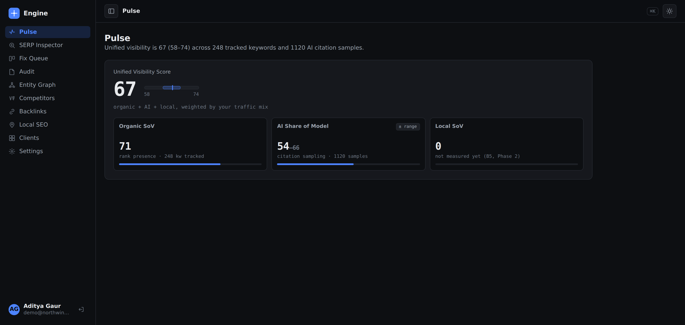

### Fix Queue — the execution loop

Every card is a persisted, reversible change with a predicted impact and a
deploy target. Transitions are recorded, not simulated.

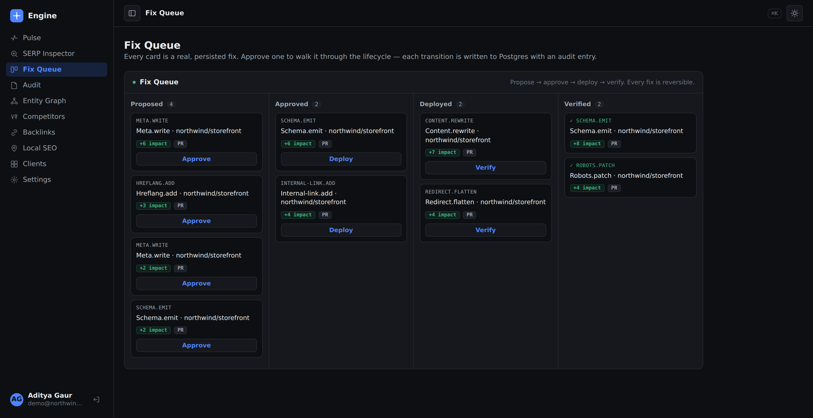

### Technical audit — findings that map to fixes

The finding inventory, ranked by predicted impact. Each row states whether a
one-click fix exists for it or whether it needs a human — and "Propose fix"
generates the actual diff and drops it into the Fix Queue.

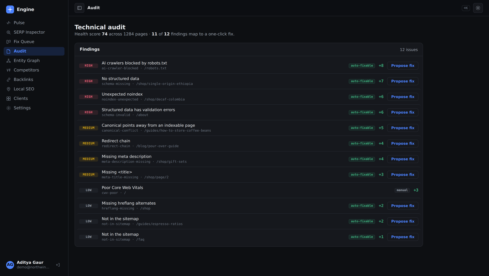

### Entity graph — does the web know who you are?

AI engines reason about entities, not URLs. This audit scores how well each
tracked entity is understood, broken into the components that say *why* it is
weak, each of which maps back to a fix.

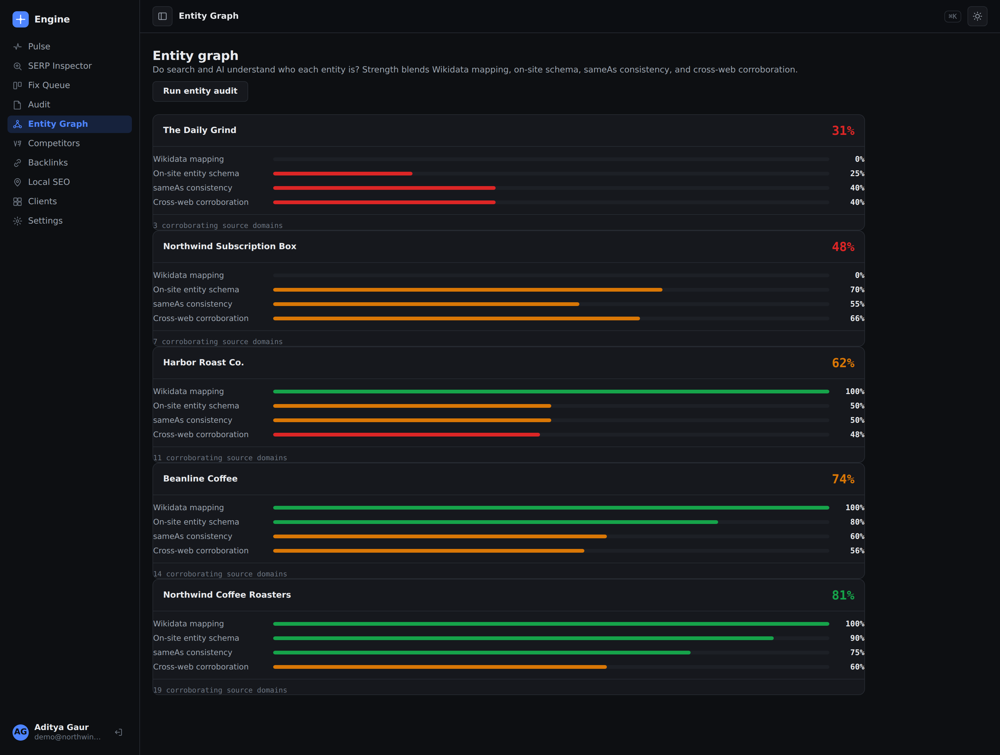

### Competitor intelligence — gaps across SEO and GEO at once

Because everything joins on the entity rather than the URL, "who outranks us"
and "who gets cited instead of us" are two views of one dataset rather than two
tools to reconcile by hand.

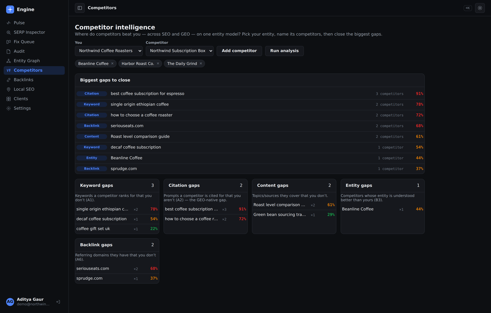

### Backlinks & mentions — citation opportunities

Which domains AI engines actually cite in a category, and which of them have
never mentioned you.

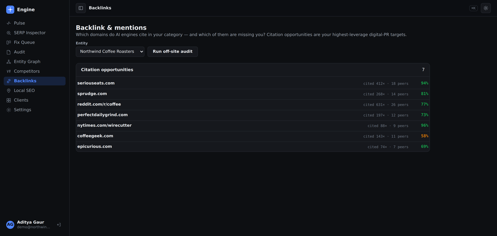

### Local SEO

Profile completeness, name/address/phone consistency across directories, and
review health per location.

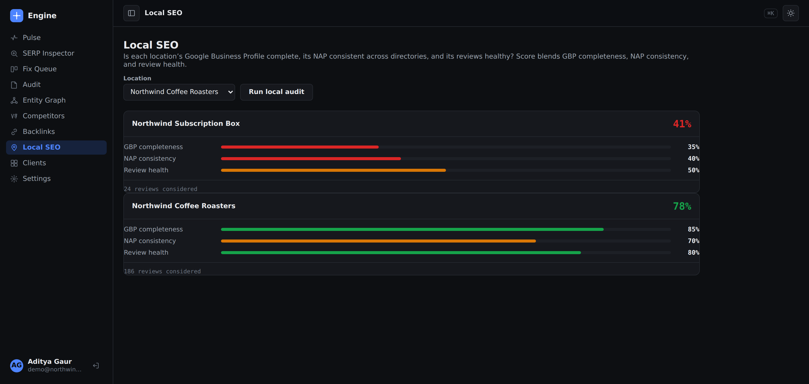

### SERP Inspector — a live lookup

A real Google query through a SERP vendor: AI Overview presence, SERP features,
computed rank, and who is beating you.

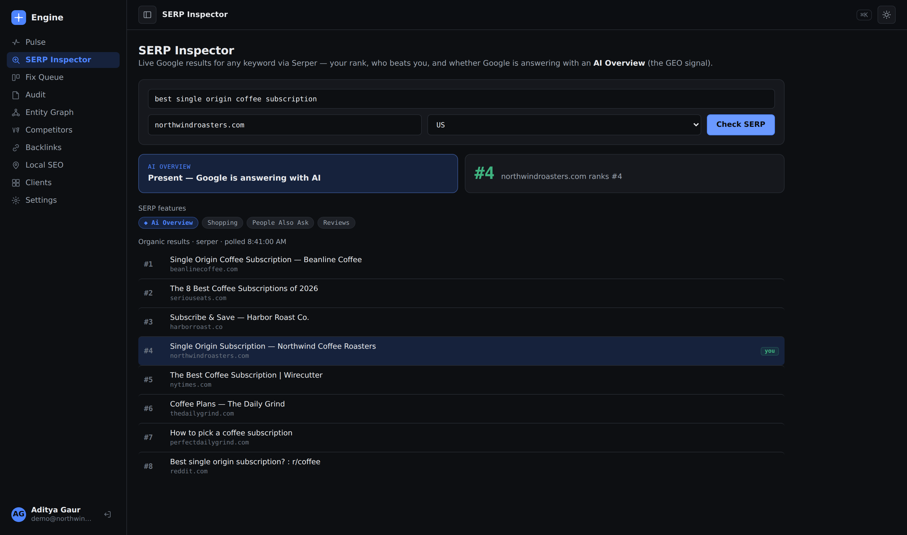

### Clients — multi-tenant, white-labelled

Agency mode: many accounts, each with its own projects and branded reporting.

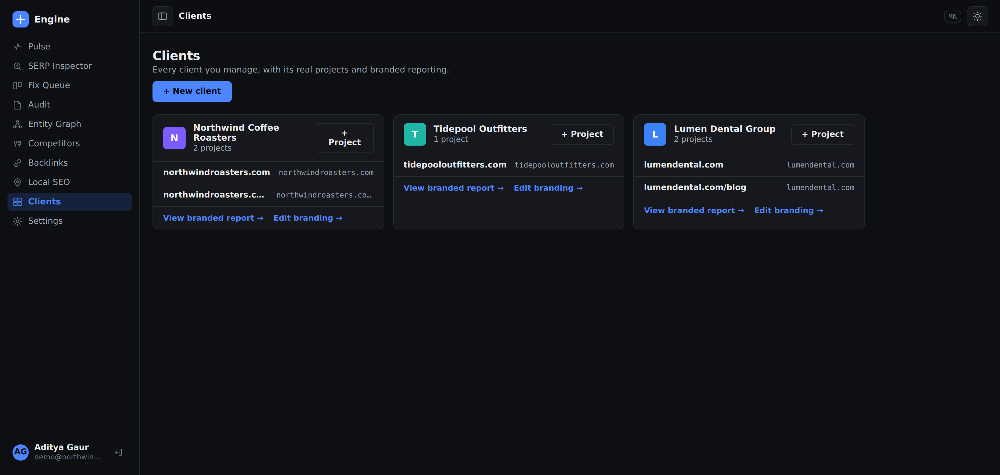

### Integrations readiness

A runtime health check that reports exactly which integrations are wired and
which environment variables are missing — so a misconfigured deployment says so
out loud instead of failing halfway through a job.

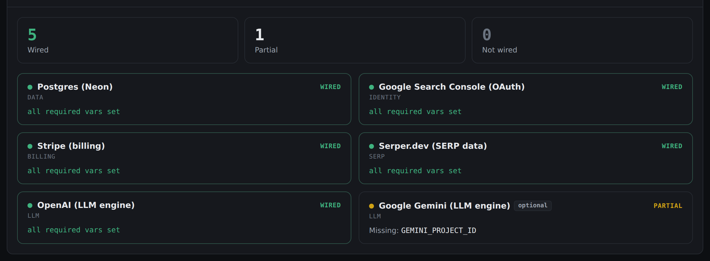

### Sign-in

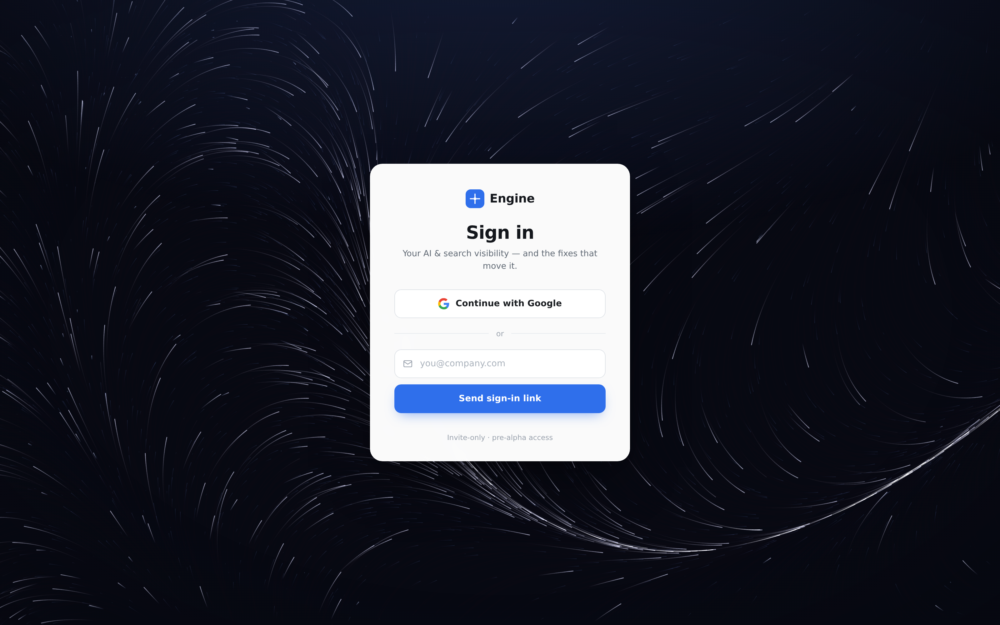

### Marketing site and public documentation

Both are built from source in the same monorepo and deployed as part of the same
Pages project.

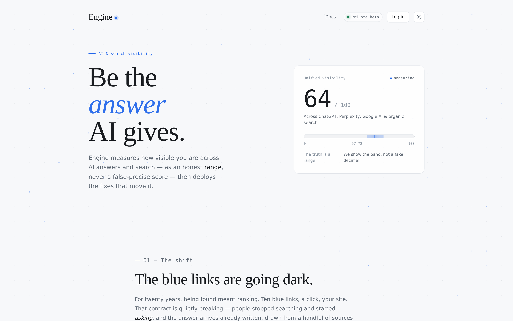

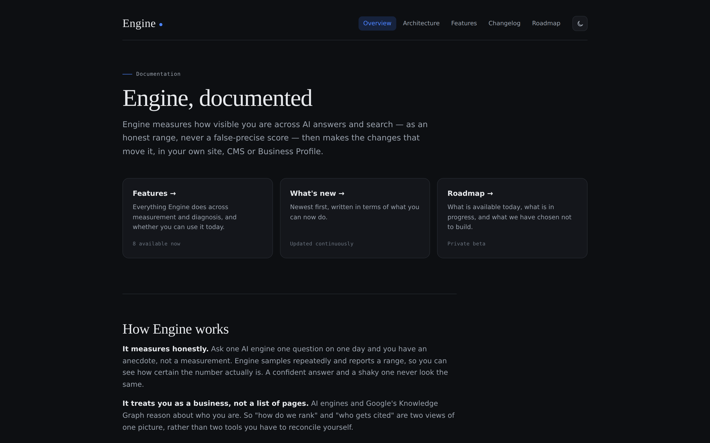

---

## How it is built

### Stack

| Layer | Technology |
|---|---|
| Language | TypeScript, end to end, strict mode |
| API | Cloudflare Workers, hand-rolled router, Postgres over HTTP |
| Database | Postgres (Neon), forward-only SQL migrations with a custom runner |
| Frontend | No framework and no bundler — TypeScript compiled to native browser ES modules |
| Auth | JWT verified against a JWKS endpoint; the gate fails closed |
| Crawler | Playwright, JS rendering, robots-aware, per-project crawl budgets |
| Deploy targets | GitHub pull requests, Cloudflare edge worker, WordPress and Shopify plugins, Google Business Profile API |
| Build | pnpm workspaces + Turborepo |
| Hosting | Cloudflare Pages and Workers |
| CI | GitHub Actions — typecheck, build and test on every push |

### Repository shape

```
apps/
  api          REST API (Cloudflare Worker)
  workers      Edge worker — deploys fixes, auto-rollback
  dashboard    The product SPA
  web          Marketing site + public docs generator
packages/      18 focused packages: crawler, scoring, diagnosis, actions,
               deploy, connectors, entity-audit, competitor, backlink,
               local, keywords, content, copilot, billing, auth, db,
               config, core
plugins/       WordPress and Shopify
infra/         SQL migrations
```

Each package is independently typechecked, built and tested. The domain packages
are pure — they take data and return data, with no I/O — which is why the
majority of the test suite runs in under twenty seconds with no database.

---

## Engineering decisions

These are the choices that shaped everything else, and the reasoning behind them.

**The join key is the entity, not the URL.** A URL, a keyword, and an AI citation
are all facets of one business entity. Committing to that at the schema level is
what makes "how do we rank" and "who gets cited" answerable in one query instead
of two products stitched together in a spreadsheet. It is also the one decision
that genuinely cannot be retrofitted later, which is why it came first.

**Uncertainty is a data type, not a UI flourish.** Ask one AI engine one question
on one day and you have an anecdote. Every prompt is sampled repeatedly and
stored as a range with a confidence band, computed in the pipeline and carried
through the API into the interface. A confident answer and a shaky one never
look the same on screen.

**Every diagnosis carries its own execution path.** A finding is required either
to name the fix that resolves it or to record why no automatic fix exists. This
is enforced at the type level, so a new detector cannot ship as a dead end that
tells a user about a problem and leaves them to solve it.

**Empty and unreachable are different facts.** Views backed by real data refuse
to fall back to sample data. A project with nothing measured says so; an API
that cannot be reached says *that*. An interface that invents plausible numbers
for both is worse than one that admits which happened — a lesson learned the
hard way from a dashboard that cheerfully reported a health score for a site
nobody had ever crawled.

**Every write to a customer surface is staged, diffed, reversible and logged.**
The product's entire value proposition is being trusted to change production
systems it does not own. That constraint drove the deploy-target abstraction,
the verification step, and the automatic rollback path — none of which are
optional features.

**No framework on the frontend.** The dashboard is roughly three thousand lines
of TypeScript compiled straight to browser ES modules — no React, no bundler, no
build step beyond `tsc`. For an interface that is mostly panels, tables and one
kanban board, a framework would have added a dependency tree and a build
pipeline in exchange for very little. It loads instantly and it will still
compile in five years.

---

## By the numbers

| | |
|---|---|
| TypeScript | ~21,600 lines across 22 packages and apps |
| Tests | 500+ unit and integration tests, all green in CI |
| Migrations | 13 forward-only Postgres migrations |
| Deploy targets | 4 (GitHub PR, edge worker, CMS plugin, Business Profile API) |
| Frontend dependencies | 0 |

---

## About

Built by **Aditya Gaur** as a solo project — product strategy, architecture,
implementation, and design.

The source repository is private. Happy to walk through the architecture, the
code, or any of the decisions above in conversation.
